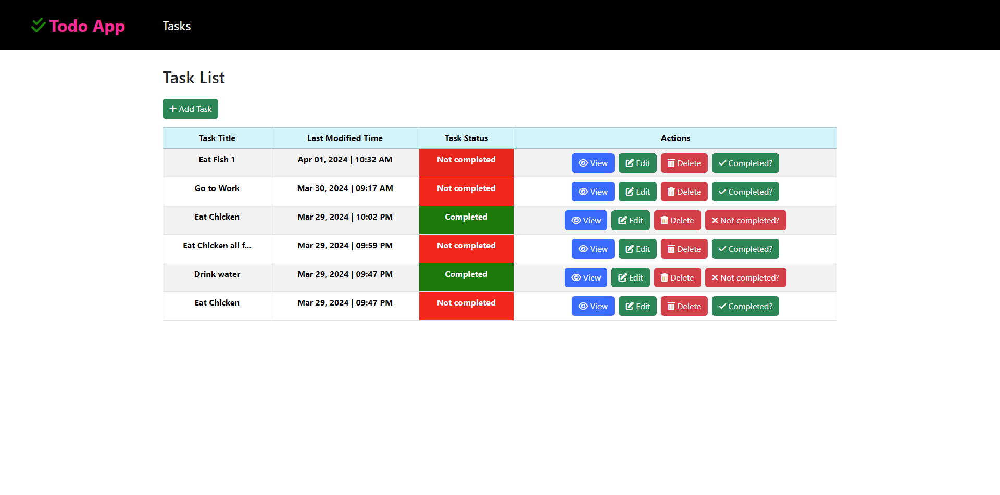
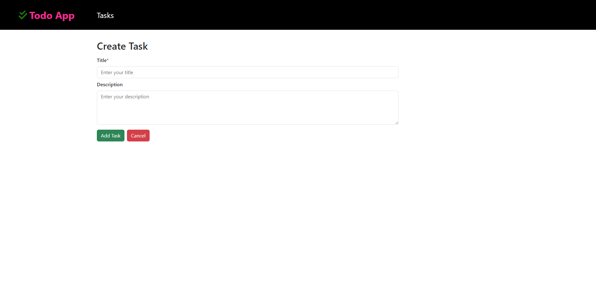
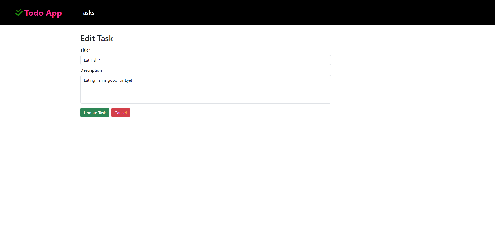
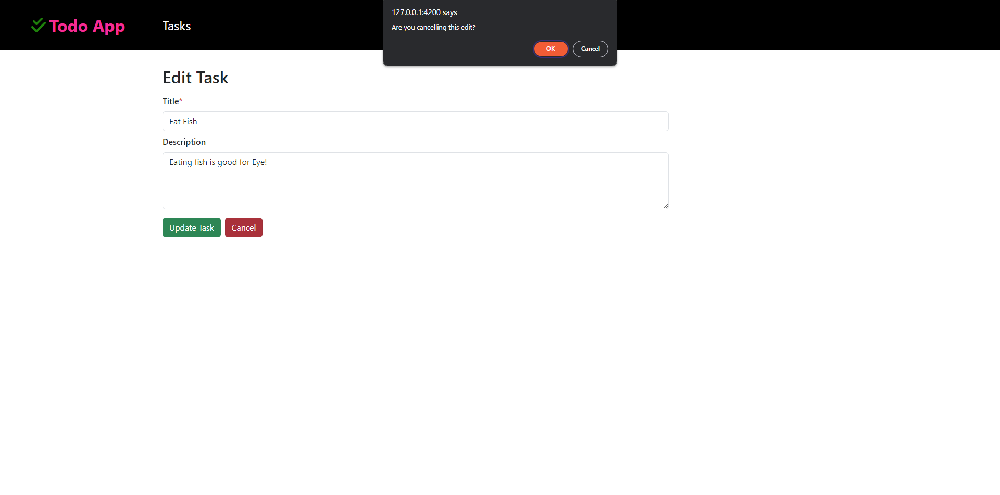
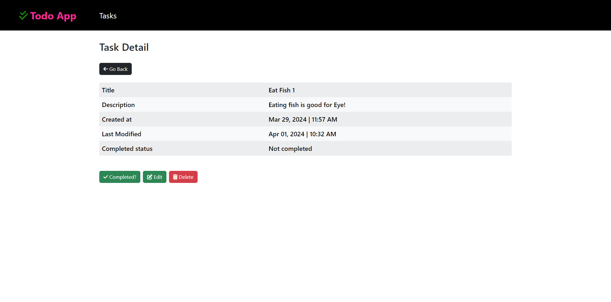
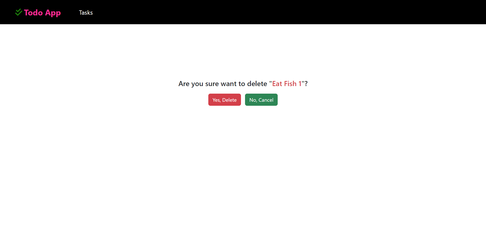

# Todo App

It helps you to add tasks and manage tasks.

```
DB Used: Mysql
FrontEnd: Angular
Backend: Django, Django Rest Framework
Styling: Bootstrap
```

### Screenshots

- **Home page**
  
- **Create task**
  
- **Edit task**
  
- **Cancel edited task**
  
- **View task**
  
- **Delete task**
  
